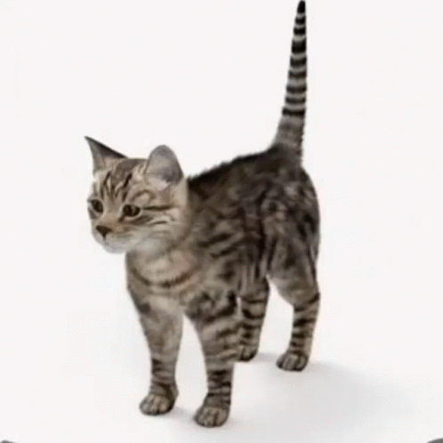
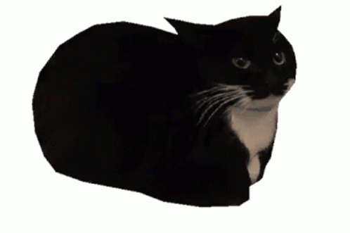

<h1 align="center"> Hey There! 👋 </h1>

  I'm pigla   
  
  
  
  <!--MORE CAT PHOTOS!!!!!!!!!!!!!!!!!!!!!!!-->

  
## Languages I know:

## What I want to learn:

## Tools I use:
 
   
  

  
Github Stats ⚡

  <a href="#">
  <a href="#">
    

